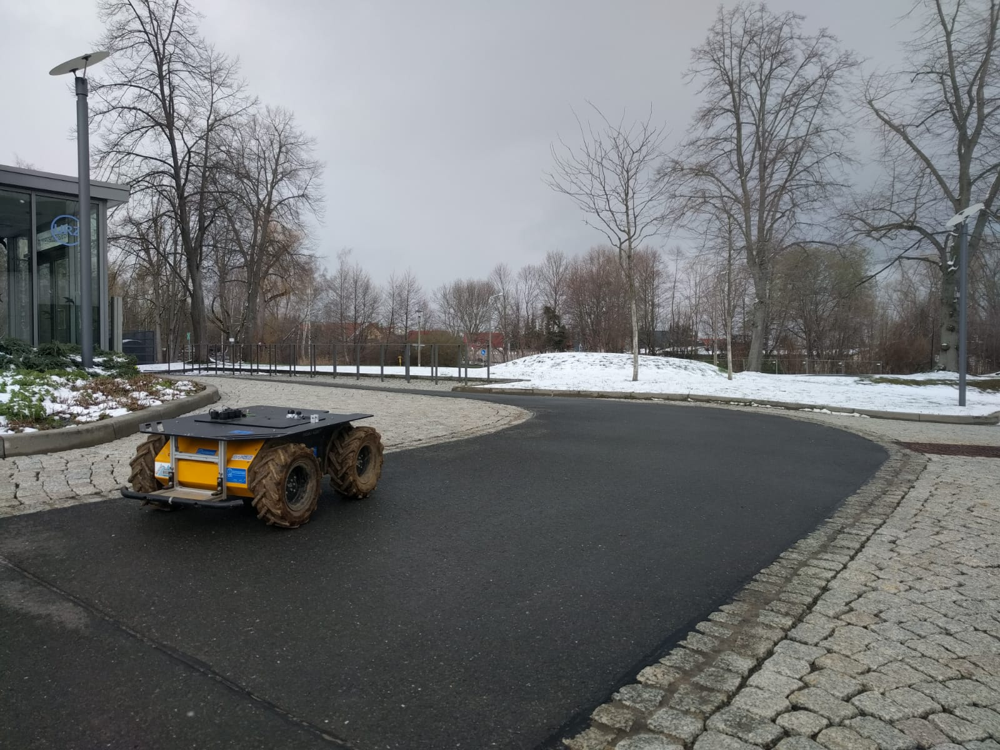
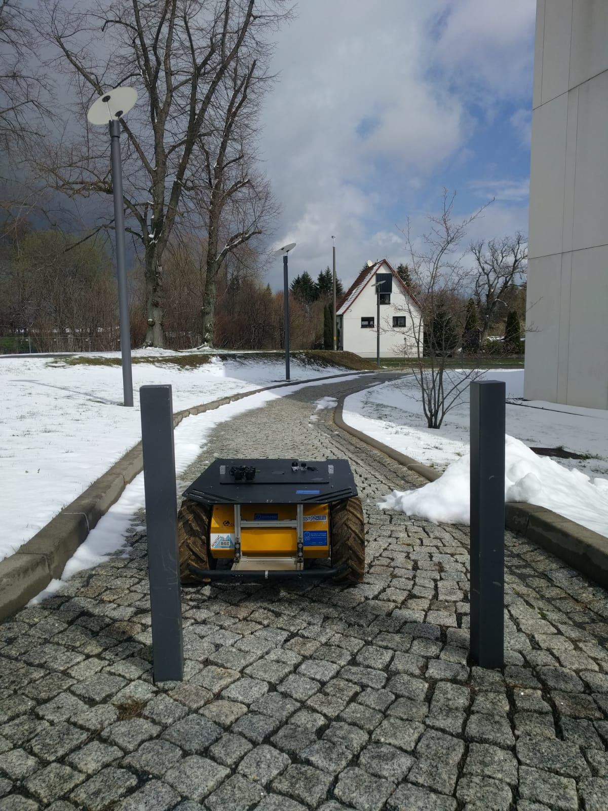
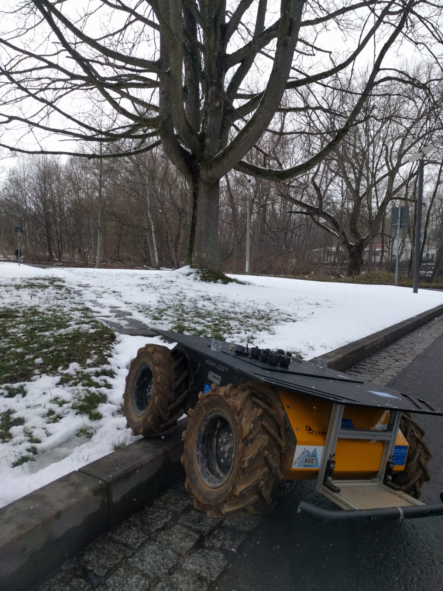
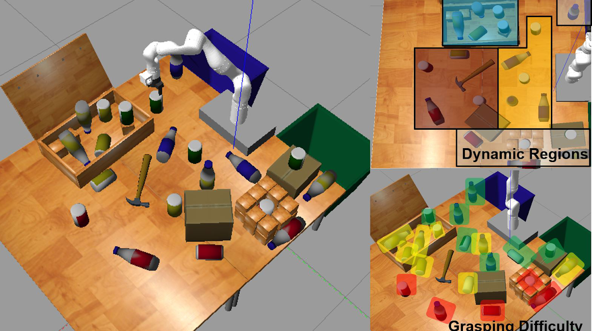

<!--

author:   Sebastian Zug & Georg Jaeger
email:    sebastian.zug@informatik.tu-freiberg.de & georg.jaeger@informatik.tu-freiberg.de
version:  1.0.0
language: de
narrator: Deutsch Female

comment:  This is a very simple comment.
          Multiline is also okay.

script:   https://cdn.jsdelivr.net/chartist.js/latest/chartist.min.js
          https://felixhao28.github.io/JSCPP/dist/JSCPP.es5.min.js

link: https://cdn.jsdelivr.net/chartist.js/latest/chartist.min.css

-->

# Praktische Phase des Robotik-Projektes 2021

Die interaktive Ansicht dieses Kurses ist unter folgendem [Link](https://liascript.github.io/course/?https://raw.githubusercontent.com/TUBergakademieFreiberg/Softwaretechnologieprojekt2020/master/README.md) verfügbar.

Das Ziel des Projektes ist die Vermittlung praktischer Fähigkeiten und Vorgehensweise zur Erstellung von Software in einem Teamprojekt.

In diesem Jahr stehen dazu zwei Aufgabenkomplexe zur Auswahl:

1. Mobile Robotik - Unser [Husky](https://clearpathrobotics.com/husky-unmanned-ground-vehicle-robot/)
2. Die [Virtual Robot Manipulation Challenge](https://2021.robocup.org/robot-manipulation)

##  Husky

In diesem Komplex zielen die Aufgaben auf die Komponenten unseres mobilen Husky Roboters ab. Das Ziel wird es sein den Roboter am Ende des Semesters auf einem Gehweg über das Campusgelände fahren zu lassen. Dafür sind verschiedene Komponenten notwendig:

* **Sensorik**
* **Kamera**
* **Navigation**
* **Integration und Organisation**

Jedes der Themenkomplexe wird von einem Team bearbeitet, wobei ein kontinuierlicher Austausch zwischen allen Teams notwendig ist.

***Sensorik***

Im Bereich der Sensorik sollen die verfügbaren Datenquellen (insbesondere GNSS und LiDAR Sensor) in Betrieb genommen werden. Dazu zählt zum einen deren Einbindung in ROS und zum anderen eine Bewertung der Güte der gelieferten Daten.

Aufgaben:
* Bereitstellung der sensorischen Daten in ROS/ROS2
* Auswertung der LiDAR Daten zur Objekterkennung
* Auswertung der GNSS und Odometrie Daten zur Navigation
* Evaluation der Sensoren hinsichtlich ihrer Güte, insbesondere in verschiedenen Kontextsituationen

***Kamera***

Die Hauptaufgabe besteht darin mit einer Kamera ([ZED2](https://www.stereolabs.com/zed-2/)) den Gehweg (und befahrbaren Bereich) vor dem Roboter zu erkennen.

Aufgaben:
* Bereitstellung der Kameradaten in ROS/ROS2
* Auswertung der Kameradaten zur Extraktion von befahrbaren Bereichen, speziell von Gehwegen
* Im Fall eines lernbasierten Ansatzes, soll eine entsprechende Datenbasis aufgebaut werden.

***Navigation***

Die Navigation nutzt die Daten der vorhandenen Sensorik um den Roboter zum Zielpunkt zu navigieren. In unserem Szenario soll der Roboter dem Gehweg auf dem Campus folgen.

Aufgaben:
* Inbetriebnahme des Navigation Stack unter ROS2
* Integration der sensorischen Daten in die Kartendarstellung(en)
* Trajektorienplanung
* Kollisionsvermeidung (LiDAR)

***Integration und Organisation***

Die individuellen Arbeiten der zuvor genannten Themenbereiche müssen integriert werden um einen funktionstüchtigen Roboter zu erhalten. Desweiteren steht lediglich ein mobiler Roboter zur Verfügung, auf den mehrere Teams zugreifen wollen. Daher ergeben sich in diesem Komplex folgende Aufgaben.

Aufgaben:
* Schnittstellendefinition und Softwareintegration (ROS vs ROS2, Nachrichtenformate, etc.)
* Unit- und Integrationtests
* Zugriff auf die Hardwarekomponenten und den Roboter
* Verwaltung von aufgenommenen Datensätzen
* Planung und Organisation von Tests mit der Hardware
* Teamübergreifende Dokumentation zum Gesamtsystem

## Virtual Robot Manipulation Challenge

In diesem Komplex steht die diesjährige ***Virtual Robot Manipulation Challenge*** im Rahmen des RoboCup im Fordergrund. Der Startpunkt bildet eine virtuelle Maschine in der ROS, die Simulationsumgebung ***Gazebo*** sowie Matlab/Simulink installiert ist. Eine genaue Beschreibung findet ihr [hier](https://drive.google.com/file/d/1XsqPbdbBytJQN5iuLUbxxRCwX8qr-MZS/view)

Die Hauptaufgabe besteht darin Flaschen und Büchsen in entsprechende Abfalleimer zu sortieren.

Aufgaben:
* Nutzung von RGB-D Kameradaten
* Objektdetektion und -Lokalisation
* Klassifikation von Objekten
* Manipulation von Objekten

Herausforderungen:
* Die Konturen der Objekte ändern sind. Das heißt, es gibt Objekte mit statischer Kontur, dynamischer Positionierung und gänzlich unbekannte Objekte. Abhängig davon wie herausfordernd die Objektidentifikation und -Manipulation ist, werden mehr oder weniger Punkte vergeben.

Für einen leichteren Start in die Challenge gab es bereits ein Q&A, das ihr [hier](https://drive.google.com/file/d/1ScSt16rdAy-nUWU4ztD-4lzDRnuOgqS_/view?usp=sharing) findet.

## In welchem Team bist du?

Eure erste Aufgabe besteht darin, euch für ein Team zu entscheiden!Findet euch den Aufgabenkomplexen entsprechend zu Teams zusammen und setzt Kommunikationswege auf.

Schickt bitte eine Mail an [Georg Jäger](mailto:georg.jaeger@informatik.tu-freiberg.de?subject=[RobotikProjektSS21]) mit den Namen eurer Teammitglieder, eurem Teamname und eurem Teamleiter (+ seine Mailadresse).

## Erste Schritte

Abhängig von den individuellen Aufgaben solltet ihr in eurem Teams zunächst:

* Die Aufgabe(n) diskutieren
* Methodiken und Ansätze zur Bearbeitung der Aufgabe identifizieren
* Deren Funktionsweise verstehen und evaluieren, ob diese zur eurer Aufgabe passen

## Ablaufplan

**Wöchentliche Meetings:**
| Aufgabenkomplex   | Meeting                  |
|:------------------|:-------------------------|
| Husky             | Donnerstag 14:00 - 15:30 |
| RoboCup Challenge | ???                      |

**Bei jedem Meeting wird ein Mitglied von jedem Team kurz die Fortschritte zusammenfassen:**
* Welche Ziele wurden für die Woche gesetzt?
* Welche Ziele wurden erreicht, welche nicht? Warum?
* Welche Ziele gibt es für die kommende Woche?

Jedes Team sollte diese Fortschritte, genannten Ziele und Probleme entsprechend dokumentieren. Hier bieten sich Wikis, Issues, Protokolle, ... an!

Daraufhin wird es die Möglichkeit geben über die aktuellen Probleme zu diskutieren, oder gegebenenfalls einen individuellen Termin zur Lösung schwierigerer Fragestellungen zu vereinbaren.
Zusätzlich wird jedes Team drei Vorträge halten.

**Vorträge**

* Exposé:

  * Motivation des Projektes
  * Stand der Technik
  * Zeitliche und inhaltliche Planung des Projektes (Meilensteinplanung)

* Zwischenstand:

  * Vorstellung der (angestrebten) Softwarestruktur
  * Stand der Implementierung
  * Wo steht ihr bezüglich des Plans? Sind Anpassungen notwendig?

* Abschlussvortrag:
  * Zusammenfassung des Projektes (zeitlich, inhaltlich, konzeptionell)

**Ablaufplan für die Vorträge**

| **Datum**              | **Vorträge**             |
|:-----------------------|:-------------------------|
| 22.04.21 14:00 - 15:30 | Exposé (Husky)           |
| 29.04.21 14:00 - 15:30 | Exposé (Husky)           |
| ???                    | Exposé (Matlab)          |
| ???                    | Exposé (Matlab)          |
| 27.05.21 14:00 - 15:30 | Zwischenstand (Husky)    |
| 03.06.21 14:00 - 15:30 | Zwischenstand (Husky)    |
| ???                    | Zwischenstand            |
| ???                    | Zwischenstand            |
| 08.07.21 14:00 - 15:30 | Abschlussvortrag (Husky) |
| 15.07.21 14:00 - 15:30 | Abschlussvortrag (Husky) |
| ???                    | Abschlussvortrag         |
| ???                    | Abschlussvortrag         |

## Bewertungskriterien und ihre Gewichtung

**1. Vorträge (2/3)**

Die Exposé-, Zwischenstands- und Verteidigungsvorträge werden mit 2/3 den Großteil der Bewertung ausmachen.
Hier geht es darum alle Aspekte des Projektes anschaulich und selbstkritisch Darzustellen.
Im Fokus stehen die eingesetzen Techniken und Konzepte, sowie Entscheidungsprozesse zu dokumentieren und zu begründen.

**2. Dokumentation (1/9)**

Ebenfalls von großer Bedeutung bei Softwareprojekten ist die hinreichende Dokumentation der Software.
Dementsprechend fließt auch diese in die Bewertung mit ein.
Entscheidend ist hierbei jedoch, dass (neben den Vorträgen, die auch der Dokumentation dienen) eine Anleitung zur Nutzung der Software sowie für mögliche Weiterentwicklungen entsteht.

**3. Tooling (1/9)**

Neben den dokumentativen Aufgaben kann der Einsatz der richtigen Tools dramatisch zum Erfolg/Misserfolg eines Projektes beitragen.
Dementsprechend sollten (soweit sinnvoll) Tools zur Automatisierung/Unterstützung des Entwicklungsprozesses eingesetzt werden.
Dokumentiert sowohl den Einsatz der Tools, als auch, wie hilfreich ihr diese Empfunden habt.

**4. Softwarearchitektur (1/9)**

Letztlich steht auch die Softwarearchitektur als zentrale Komponent eines Softwareprojekts im Fokus des Semesters.
Hier soll vor allem eine konsistente, intuitive Struktur angestrebt werden.
*Hinweis: Eine Software, die sich schlecht dokumentieren lässt, ist vermutlich nicht intuitiv oder gar schlecht strukturiert!*

**Beispielrechnung:**

| **Vortrag 1**   | **Vortrag 2**    | **Vortrag 3**    | **Dokumentation** | **Tooling**      | **Softwarearchitektur** | **Note** |
|:----------------|:-----------------|:-----------------|:------------------|:-----------------|:------------------------|:---------|
| $1.0 \cdot 2/9$ | $2.3 \cdot  2/9$ | $1.3 \cdot  2/9$ | $2.0 \cdot 1/9$   | $1.3 \cdot  1/9$ | $1.7 \cdot 1/9$         | **1.7**  |

## Organisatorisches

Falls noch nicht vorhanden, benötigen alle Teilnehmer einen Account für unsere GitLab Instanz.
Schreibt dazu bitte eine **Mail** mit dem gewünschten **Username** an [Georg Jäger](mailto:georg.jaeger@informatik.tu-freiberg.de)

Alle Teams sollten ihr Softwareprojekt innerhalb eines dort angesiedelten Git-Repositories durchführen.
